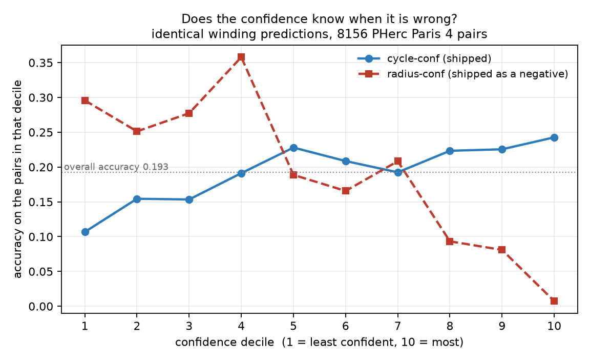
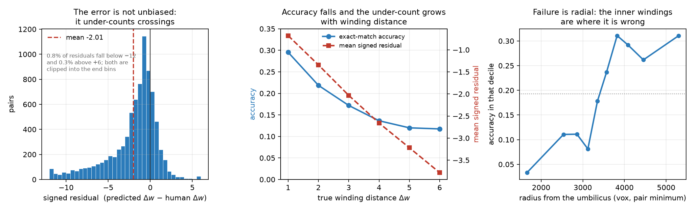
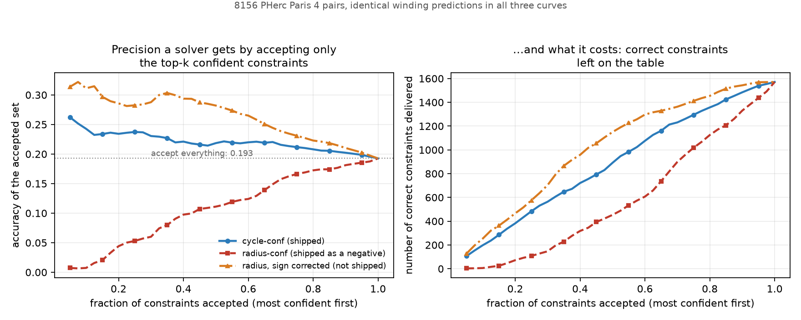
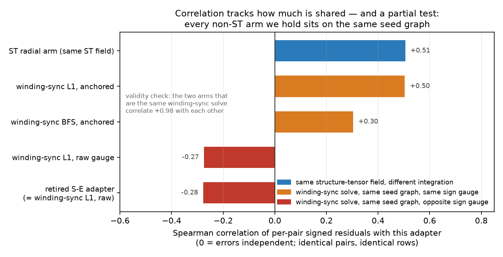

# ST winding adapter

A generator of **relative winding constraints** for the Herculaneum scrolls: given two
points inside a scroll volume, how many sheet crossings lie between them.

**Measured range of validity (2026-08-20).** This adapter gives reliable same-wrap
decisions and winding-step signs only within about 30 voxels along a sheet (measured
coherence length: 29.8<!--ledger:axfix.coherence_length_vox--> voxels); beyond that its
winding count drifts by whole wraps and must not be trusted — use it to seed or check
local constraints, never to carry a winding number across a scroll. A repair was
attempted against pre-registered criteria and failed; the measurement, the mechanism
and the attempt are in
[The drift is radial and not repairable](#the-drift-is-radial-and-not-repairable-2026-08-20).

It gets that number out of the CT image itself — by integrating the lamina normal from
the **structure tensor** along the path between the two points and counting the sheets
actually crossed. It therefore makes **no fixed-pitch assumption**: no "one winding is
N micrometres" constant enters anywhere.

Output is the plain one-file adapter interface used by the public
[`constraint-gauge`](https://github.com/pscamillo/constraint-gauge) bench — a point
list, one winding number per point, one confidence per point:

```json
{"name": "...", "points_xyz": [[x, y, z], ...], "winding": [...], "conf": [...]}
```

## Why you might care

Winding constraints are a crowded corner of this project. There are several generators
already, and this one is not uniformly better than all of them — on an independent
same-wrap reference it is beaten outright by a distance threshold (next section, read it
first). Two things may still make it worth ten minutes:

* **It is a different signal path.** Everything else in this niche starts from a spacing
  or pitch estimate. This starts from image structure. We have since measured what that
  actually buys, and it is narrower than the argument suggested: the pairs it gets
  *right* are close to independent of what winding-sync L1 gets right, but the signed
  errors are not independent at all. See
  [Independence from the spacing arms](#independence-from-the-spacing-arms-measured).
* **Its confidence carries real information, but it is not the best confidence
  available on these predictions.** The shipped confidence is cycle-consistency — how
  many winding discontinuities accumulate around closed paths through a point. Accepting
  only the top 10% of constraints raises accuracy from 0.193 to 0.243 (bootstrap 95% CI
  on the lift [+0.016, +0.073]). Plain distance from the umbilicus beats it on the
  identical predictions — decisively (AUC 0.671 against 0.567; a clustered paired
  bootstrap of the difference, measured 20 August 2026, excludes zero) — and the
  decision on our side is to treat distance as the primary confidence signal and
  cycle-conf as a second reported one. Both are reported
  [below](#a-geometric-baseline-beats-our-confidence), which also says why the shipped
  files still carry cycle-conf in their `conf` column.

If you only need a winding number and already trust your pitch, you probably do not need
this.

## An independent same-wrap reference beats this adapter with a ruler (2026-08-20)

This is our own finding, from our own search for an independent check, and it belongs
above the score table rather than under the caveats.
[`scroll-truth`](https://github.com/aistae/scroll-truth) (karasukun) ships pairwise
same-wrap ground truth for PHerc Paris 4, derived from raw CT intensity votes with no
model output in the loop. On 2026-08-20 we scored this adapter against it by
reimplementing the scoring from its documented file formats — none of the reference's
code was executed on our side. Coverage is real, not anecdotal: **46,946 of its 161,198
judged patch pairs (29%)** carry our points on both patches, via 707 of our points
attached to 976 reference patches within the spiral fitter's own 2.5-voxel tolerance.

The pipeline was validated before it judged us: the 2,173 hand-annotated ground-truth
points, pushed through the identical attachment-and-pairing path, agree with the
scroll-truth reference on **99.0% of 23,140 covered pairs** (97.5% on the 6,878 pairs in
the hard 3–15 voxel band). So the patch identity is right and the reference is sound —
which also independently confirms that reference at roughly ten times the scale of its
own hand-checkable subset, and that cross-validation stands as a contribution regardless
of what follows. One bookkeeping discrepancy found on the way: the shipped reference
files hold 201,410 rows, not the ~258,000 its README table states; we scored what ships.

The verdict on us, plainly:

* **A plain surface-distance threshold beats this adapter in every region.** Per-region
  F1 with the reference as truth: **ours 0.40–0.64, distance 0.84–0.86** (four
  well-covered regions; the fifth, z6500, holds only 112 covered pairs and is a
  footnote). We also lose to distance in the hard 3–15 voxel band — inside one wrap
  period, exactly where a structure-tensor method is supposed to earn its keep. We beat
  a shuffled-winding control everywhere (its F1 is 0.04–0.06), so the field is not
  noise; it is worse than a baseline that needs no model.
* **On pairs whose surfaces actually touch (under 3 voxels), which the reference and the
  hand-annotation oracle both call the same wrap 94–97% of the time, we say "same wrap"
  only 34–70% of the time**, depending on region.
* **The mechanism is measured, not guessed: the winding field decoheres along the
  sheet, with a coherence length of 29.8<!--ledger:axfix.coherence_length_vox-->
  voxels** — the separation at which the median same-wrap residual crosses half a
  wrap. Among reference same-wrap pairs, our winding difference stays under 0.5 for
  **99.7%** of closest point pairs separated by 0–10 voxels (an earlier version
  rounded this to 100%; the stored fraction is 0.9971), **52%** at 10–25 voxels,
  **19%** at 25–50 voxels, essentially never at 100–300 voxels, and past 300 voxels
  the median drift is **7.4 windings**<!--ledger:axfix.drift300_med_V0-->. The same
  shows up per patch: of 640 reference patches carrying two or more of our points,
  466<!--ledger:axfix.st_patch_spread_gt05_V0--> have internal winding spread above
  half a wrap, and the spread grows with the patch's z-extent. Beyond a few tens of
  voxels this field commits silent wrap-steps routinely — the very failure a
  winding-constraint generator exists to detect. An earlier version of this bullet
  said the drift is "predominantly in z"; corrected 2026-08-20 after the follow-up
  investigation below: the residual is deterministic in accumulated *radial*
  displacement, and axial displacement by itself is nearly free — tall patches drift
  because following a sheet down z accumulates radial footprint, and it is the radial
  part the field cannot handle. See
  [the next section](#the-drift-is-radial-and-not-repairable-2026-08-20).
* **The bench in the score table below could not have seen this, by construction.** The
  constraint-gauge ground-truth chains walk radially across adjacent wraps at short
  range; they never follow one wrap along z far enough to expose axial drift. M1 0.295
  there and F1 0.40–0.64 here are not in tension — they measure different directions,
  and the direction constraint-gauge cannot probe is the one we fail. No aggregation
  choice rescues it (patch-median pooled F1 0.563, closest-point 0.721 — inflated by
  shared points, 0.486 in the hard band — same-z 0.704, all far below distance), and
  confidence gating buys 0.64 pooled at the cost of half the coverage.

What survives this: the sign machinery (with one measured bug in the shipped sign
convention on two slabs — next section), the near field (0–10 voxels), and the
umbilicus anchor, whose value was measured independently in the Ablations section.
What does not survive is any reading of this adapter as a reliable same-wrap detector
beyond about 30 voxels of separation along a sheet — and a repair attempt has since
failed against pre-registered criteria (next section), so that boundary is where the
claim stays: use the adapter to seed or check local constraints, never to carry a
winding number across a scroll. Read everything below, the score table included, with
this section in front of it.

## The drift is radial and not repairable (2026-08-20)

The section above left open what the drift actually is and whether it can be fixed.
A follow-up investigation answered both, against criteria for success written down
before any repaired variant was scored. Same covered pairs, same thresholds, same
harness as above; every number below is tracked in our provenance ledger under
`axfix.*`.

**What the drift is.** On 4,003 same-wrap point pairs, with the expected in-plane
angular term subtracted, the winding residual is deterministic in accumulated radial
displacement, not stochastic in z: a linear model in (dr, dz) explains R²
0.743<!--ledger:axfix.res_dr_dz_R2--> of the residual on same-field pairs beyond 30
voxels; correlation with dr alone is 0.859<!--ledger:axfix.res_corr_dr-->, with dz
only -0.154<!--ledger:axfix.res_corr_dz-->. It is not a z-ramp, not a random walk,
and not discrete slips (the share of mid-range residuals within 0.15 of an integer
is 0.47<!--ledger:axfix.res_frac_near_integer-->, where a continuous spread would
give 0.30). The slope is the tell: the residual grows by
0.0275<!--ledger:axfix.res_vs_dr_slope--> wraps per voxel of radial displacement —
an effective wrap period of about 36 voxels where the true period is 15–21 — so
beyond its coherence length the field degrades into a radius measurement at roughly
half the true gain. That is the same object as the −2.01 mean under-count in the
error-audit section below. Axial displacement by itself is nearly free: at matched
separation 80–340 voxels, the median |residual| is
0.744<!--ledger:axfix.medres_sep80_340_dzdom--> wraps for axially-dominated pairs
against 1.681<!--ledger:axfix.medres_sep80_340_inplane--> for in-plane-dominated
ones. What the section above first reported as "axial drift" is radial footprint
accumulated while following a sheet down z.

**The coherence length is 29.8<!--ledger:axfix.coherence_length_vox--> voxels** —
the separation along a sheet at which the median same-wrap residual crosses half a
wrap. Inside it the adapter is essentially perfect (99.7% correct same-wrap at 0–10
voxels); by 25 voxels it is a coin flip; beyond 50 it is wrong essentially always.

**The repair attempted, and where it stopped.** Two repairs follow from the
diagnosis, both GT-free and reference-free (they use only the method's own ST
fields, the umbilicus, and the slice geometry): **V1** canonicalises chirality
(winding increases outward in every slab) and ties each slab's undefined constant to
the umbilicus through the radial ST integral; **V2** adds per-(x, y) linear
z-interpolation of the anchored field between the two bracketing slices — median
correction applied, 2.238<!--ledger:axfix.v2_correction_med_wraps--> wraps per
point. The pass/fail bar was pre-registered in writing before any repaired variant
was scored: REPAIRED requires the pooled 0–3 voxel touching band ≥ 90% and
per-region F1 within 0.05 of the distance baseline; PARTIALLY REPAIRED requires
band ≥ 80% and pooled F1 +0.10 absolute; the near-field gauge check must not
degrade in either case.

The same-wrap ladder (reference same-wrap pairs, closest attached points, identical
harness to the section above):

| separation (vox) | n | shipped | V1 anchor | V2 anchor + lerp |
|---|---|---|---|---|
| 0–10 | 4,881 | 99.7% | 99.7% | 99.9% |
| 10–25 | 163 | 52.1% | 52.1% | 68.1% |
| 25–50 | 16 | 18.8% | 18.8% | 31.2% |
| 50–100 | 6 | 0% | 0% | 0% |
| 100–300 | 93 | 0% | 0% | 3.2% |
| 300–3,000 | 859 | 5.5% | 3.4% | 7.6% |

The interpolation does something real at mid-range: the 10–25 band moves
0.521<!--ledger:axfix.ladder_10_25_V0--> →
0.681<!--ledger:axfix.ladder_10_25_V2-->, the 25–50 band
0.188<!--ledger:axfix.ladder_25_50_V0--> →
0.312<!--ledger:axfix.ladder_25_50_V2-->, and the median drift beyond 300 voxels
falls from 7.39<!--ledger:axfix.drift300_med_V0--> to
5.89<!--ledger:axfix.drift300_med_V2--> windings. And it does not matter: the
ladder still collapses by 50 voxels, patches with internal spread above half a wrap
go 466<!--ledger:axfix.st_patch_spread_gt05_V0--> →
485<!--ledger:axfix.st_patch_spread_gt05_V2--> of 640, pooled F1 goes
0.563<!--ledger:axfix.st_pooled_f1_V0--> →
0.491<!--ledger:axfix.st_pooled_f1_V2--> (V1:
0.563<!--ledger:axfix.st_pooled_f1_V1-->, exactly the shipped value — the anchor is
a no-op on this bench), and the pre-registered progress metric, the 0–3 voxel
touching band, stays flat: 0.523<!--ledger:axfix.st_band03_V0--> shipped,
0.522<!--ledger:axfix.st_band03_V1--> V1, 0.505<!--ledger:axfix.st_band03_V2--> V2,
against 94–97% from the reference and the hand oracle. Distance stays at F1
0.84–0.86 in every region; no variant comes near it anywhere.

**Verdict, against the pre-stated conditions: NOT REPAIRED.** Neither variant
reaches even the partial bar. The criteria also fixed in advance that a V2-over-V1
edge below 0.02 pooled F1 would not justify shipping the extra machinery; V2 lands
*below* V1 on pooled F1. The in-plane half-gain decoherence has no candidate fix
inside this method — no anchoring, interpolation, or integer constraint can put back
information the in-plane integration never captured — and the criteria file
predicted in writing that it would remain. This is why the range-of-validity
statement at the top of this README is a boundary, not a to-do item. (V2's
near-field side effect, for completeness: M1 stays at
0.2955<!--ledger:axfix.gauge_M1_V2--> and MAE improves to
2.4646<!--ledger:axfix.gauge_MAE_V2--> from
2.5866<!--ledger:axfix.gauge_MAE_V0-->.)

**Two by-products of the investigation, disclosed because they are our own bugs:**

* **The shipped sign convention on the z7500 and z13500 slabs is wrong.** The
  global sign of each per-slice field was in fact matched to the per-slice
  winding-sync L1 field, not anchored to the umbilicus as the Method section below
  used to state, and on those two slabs the shipped fields come out with winding
  *decreasing* outward. The shipped adapter JSONs are affected: points in those two
  slabs carry the inverted convention. Correcting the chirality alone (part of V1)
  moves the reimplemented near-field bench M1 from
  0.2955<!--ledger:axfix.gauge_M1_V0--> to
  0.3064<!--ledger:axfix.gauge_M1_V1--> on the 8,156 GT pairs. The files have
  **not** been re-emitted, for the same reason the confidence column was not
  swapped: re-emitting changes a scored submission, and we will not do that
  silently. Until a corrected arm is published and re-scored on the bench, the
  shipped files stand as scored, bug included.
* **Two of our per-slice umbilici contradict each other.** The z7500 umbilicus sits
  about 6,600 voxels in-plane from the z9000 one, which is physically impossible
  for the same scroll core — one of the two is wrong, and we do not know which.
  This touches every quantity computed from the z7500 umbilicus: the
  distance-from-umbilicus confidence for points in that slab, the
  umbilicus-anchored constant of that field in V1/V2 above, and the z6500
  scroll-truth region (112 covered pairs, already flagged above as a footnote). It
  does not touch the winding magnitudes themselves (the L2 group synchronisation
  does not use the umbilicus) or the other slabs.

## Scores

Scored by the **bench author**, on his own machine, on the PHerc Paris 4 ground truth
(8156 within-collection pairs at dw 1–6), 30 July 2026. Labels follow the bench's own
convention so the numbers keep their context.

| adapter file | arm | scorable | M1 (exact on dw=1) | MAE | confidence |
|---|---|---|---|---|---|
| `S-E-improved-node.dense.json` | ST + L2 group-sync, cycle-conf | 8156 / 8156 (coverage 1.000) | **0.295** | 2.587 | rising, 0.11 → 0.24 across deciles (with local dips — see the figure below) |
| `S-E-improved-node-radiusconf.dense.json` | same windings, radius as conf | 8156 / 8156 | 0.295 | 2.587 | **anti-calibrated, 0.29 → 0.01 — do not use** |
| `S-E-improved-radial.dense.json` | ST radial | 8156 / 8156 | 0.233 | 3.525 | flat |

**Which tolerance these are scored at, because it changes them.** Everything in the table
above is the bench's constant matching tolerance, τ = 37.5 voxels, which is the regime the
scoring ran in on 30 July. The bench later moved toward a per-point τ derived from local
node spacing (median 9.17 vox). We rescored **our coarse arm and the two winding-sync
baselines** under it (`_localtau/paris4_rescore.json`, our own run) — the coarse arm is
the seed-snap graph of the Ablations section, M1 0.262 at constant τ, and is **not one of
the three adapter files in the table above**. Coverage falls from 1.000 to **0.2115**
(1725 of 8156 pairs) for all three rescored arms alike, our coarse arm goes
0.262 → **0.286**, and the winding-sync L1 rebuild goes 0.165 → **0.243** — so on the one
arm of ours scored both ways, the lead over the L1 rebuild narrows from about 1.6× to
about **1.18×**. **The dense arm in the table above (M1 0.295) has not been rescored
under the per-point rule**, so its 1.8× constant-τ lead has no per-point-τ counterpart.
An earlier version of this paragraph said "we rescored all three arms under it" and set
the 1.18× against the 1.8×; that was false about which arms were rescored, and the ratio
comparison was across arms — corrected 2026-08-20. Neither regime is wrong; quoting a
coverage or a lead without saying which regime and which arm produced it would be.

Context for those numbers:

* **M1 0.295 is about 1.8× the strongest baseline we can rebuild.** This README used to say
  "roughly 2.3× the L1 baseline (0.130)", and that was wrong in its attribution. Rebuilding
  the baselines ourselves on the identical 8156 pairs, 0.130 matches to three decimals *our
  own retired built-in S-E adapter* (M1 0.1298, MAE 4.102) — not a winding-sync L1 solve.
  Our own winding-sync L1 rebuild scores **0.127 in the raw gauge and 0.165
  umbilicus-anchored** (MAE 3.992 / 2.989). The fair comparison is against the anchored
  rebuild — it is the strongest baseline we can rebuild, and comparing against the weaker
  raw gauge would flatter us — and that puts the lead at 0.295 / 0.165 = **1.8×**. An
  earlier version justified this choice by saying our arm "carries the same anchor";
  measured 2026-08-20, the shipped arm's per-slab sign is in fact matched to the
  winding-sync L1 field, not umbilicus-anchored (see
  [the drift section](#the-drift-is-radial-and-not-repairable-2026-08-20)), so that
  justification was wrong; the choice of the stronger baseline stands on its own. The old sentence "it is not reproducible from this repository alone" was half
  right and is replaced by something checkable: all five baseline figures come out of
  `evidence_numbers.py` (see [below](#re-deriving-these-numbers)) from our local bench runs,
  which are not in this repository; what was never reproducible was the *label* on 0.130.
* The score is **identical at all three matching tolerances** (τ/2, τ, 2τ). That sweep
  is the bench author's own diagnostic run of 30 July 2026, reported here on his word:
  it is not among the numbers `evidence_numbers.py` re-derives, so it is not reproducible
  from this repository's scripts. (We re-ran the public
  runner on our local ground-truth copy at τ = 18.75 / 37.5 / 75 vox on 20 August 2026
  and got the same M1 / MAE / coverage at all three — but that check needs our local run
  directory, which does not ship either.) The evidence that the point density this
  submission uses introduces no selection bias is not this sweep but the dense-emission
  ablation below, whose predictions are byte-identical, 0 of 8156 differing; an earlier,
  sparser submission of ours was blocked by the bench's node-gap gate exactly because it
  could have introduced one.
* `cycle-conf` was, in the bench author's words, *"the best confidence signal measured
  here so far"*, including his own estimator. His exact wording matters: the bench scores
  confidence by rank, so that is a statement about monotone discrimination, not about
  calibration, and this README does not upgrade it to one. It is also one bench on one
  scroll on one date, two further submissions have arrived since, and it does not survive
  contact with the geometric baseline in the next heading down.



Both curves come from the same winding predictions; only the reported confidence
differs. `cycle-conf` rises 0.107 → 0.243 across deciles, `radius-conf` falls
0.296 → 0.007 — it is most wrong exactly where it is most sure. Reproduce with
`make_calibration_figure.py` from the runner's per-pair CSVs.

Note the y axis is accuracy over **all** pairs in a decile (overall 0.193), not
the M1 figure in the table above, which is exact agreement on dw = 1 only. The
two numbers answer different questions and are not comparable.

The radius-conf arm is kept in the repository deliberately as a clean negative: identical
windings, a confidence that inverts. It is what a plausible-looking confidence signal
looks like when it is wrong.

### A geometric baseline beats our confidence

radius-conf is anti-calibrated **because its sign is inverted, not because radius is
uninformative**. It is defined as `1 − normalised radius`, and accuracy in fact rises with
radius (see [Failure is radial](#failure-is-radial)). Flipping the sign — plain distance
from the umbilicus, pair minimum, no ground truth involved, available to anyone — gives a
better confidence on the *identical* winding predictions than the cycle-consistency signal
we shipped:

| confidence on the same predictions | AUC(conf → hit) | top-10% acc | top-10% acc on dw=1 | top-10% lift over accept-all [95% CI] |
|---|---|---|---|---|
| cycle-conf (shipped) | 0.567 | 0.243 | 0.361 | +0.045 [+0.016, +0.073] |
| radius-conf (shipped as a negative) | 0.331 | 0.007 | 0.025 | −0.186 [−0.195, −0.175] |
| **radius, sign corrected (not shipped)** | **0.671** | **0.311** | **0.453** | **+0.117 [+0.087, +0.147]** |
| rank-sum of cycle + corrected radius | 0.656 | 0.314 | — | — |

It wins at every accept fraction we measured, from 5% to 95%, and it wins on dw = 1 pairs
alone (0.453 vs 0.361 at the top 10%, 0.477 vs 0.370 at the top 5%), where the "it is just
picking easy pairs" objection does not apply. Combining the two does not beat the corrected
radius on its own: the rank-sum row in the table above is nominally +0.003 ahead on the
top-10% cut while sitting below on AUC (0.656 against 0.671), and a paired bootstrap of
the difference — pair-level and clustered by ground-truth collection, measured
20 August 2026, not yet shipped in this repository — straddles zero on the top-10% cut
under both schemes. A wash on one cut and a loss on the other is not a combination worth
shipping.

**This is a negative result for the claim this package makes about its confidence**, and it
is ours, found by auditing our own submission. We have not quietly swapped the shipped
confidence: cycle-conf measures the method's own internal consistency and radius is a proxy
for "this part of the scroll images well", and those are different things to know. But
anyone weighing whether cycle-conf is the reason to spend ten minutes here should weigh it
against a one-line geometric rule that does better.

**Where that decision stands, 2026-08-20.** A follow-up measurement pass confirmed the
gap is decisive — the clustered paired bootstrap on ΔAUC excludes zero, and distance wins
in every true-Δw stratum separately — and that no combination we tried (equal-weight rank
average; a grouped-cross-validated two-feature logistic) beats distance alone by more
than the measurable noise. The decision is therefore: distance from the umbilicus is the
primary confidence signal for these predictions, cycle-conf the second reported one. The
adapter files in this repository have **not** been re-emitted: their `conf` column still
carries cycle-conf, and the corrected radius exists here only as the sign-flip of the
negative-control arm plus the rows above. Re-emitting the node arm with the corrected
radius changes a scored submission file, and we will not do that silently; until a
re-emitted arm is published and re-scored on the bench, the table above is the confidence
evidence, and the shipped `conf` column should be read as the weaker, historical signal.

## What we measured ourselves

The score table above is the bench author's. This section — and the geometric-baseline
result above it — we computed ourselves on 19 August 2026, from the per-pair CSVs that
our own local runs of the bench code wrote: the same 8156 pairs, in the same row order,
13 arms. It is an audit of our own
submission and several of the results make the submission look worse.

What licenses comparing arms row by row: the bench's pair construction is deterministic and
every run we hold has coverage 1.000, so row *i* of every scored CSV is the same GT pair.
The script re-derives the 8156 pairs from the ground truth and checks the `dw_true` column
of all 13 arms against them; all 13 match exactly.

### The error is biased: it under-counts



| quantity | value |
|---|---|
| mean signed residual (predicted Δw − true Δw) | **−2.010** |
| median | −1.188 |
| sd | 3.951 |
| 95% CI on the mean (normal approx) | ±0.086 — not consistent with zero |
| under-counted / exact / over-counted (rounded) | 5531 (67.8%) / 1571 (19.3%) / 1054 (12.9%) |

Two pairs in three are under-counted, and it is not a tail artefact — the median is −1.19.
The deficit is proportional to distance rather than a constant offset: mean predicted Δw
runs 0.32, 0.66, 0.97, 1.34, 1.78, 2.22 as true Δw goes 1 → 6, so predictions grow about
0.38 per unit of truth, and accuracy falls 0.296 → 0.117 across the same range.

**One scalar gain does not fix it.** An oracle grid search over `g·dw_pred` — oracle
because it uses the ground truth, so the adapter could never apply it — peaks at g = 0.95
with accuracy 0.1947 against 0.1926 at g = 1. The best-MAE gain, g = 0.80, gives MAE 2.510
against 2.587. A rescale buys about 0.002 accuracy. What remains is scatter and wrong-sign
predictions, not a mis-set scale: the predicted sign is correct on 0.652 of all pairs but
only **0.543** on dw = 1, which is close to a coin flip.

### Failure is radial

Accuracy by decile of the pair's minimum radius from the umbilicus (overall accuracy 0.193):

| decile | radius (vox) | n | accuracy |
|---|---|---|---|
| 1 | 980–2342 | 814 | **0.033** |
| 2 | 2342–2732 | 814 | 0.111 |
| 3 | 2732–2986 | 819 | 0.111 |
| 4 | 2986–3258 | 813 | 0.081 |
| 5 | 3258–3446 | 814 | 0.178 |
| 6 | 3446–3692 | 820 | 0.237 |
| 7 | 3692–3954 | 814 | **0.311** |
| 8 | 3954–4219 | 816 | 0.292 |
| 9 | 4219–4688 | 814 | 0.262 |
| 10 | 4688–5906 | 818 | 0.311 |

A factor of nine between the inner and the outer decile. On the inner windings the adapter
is close to useless; on the outer half it is around 0.30. Radius per pair is computed from
the same per-slice umbilicus the generator itself used. This is also the mechanism behind
the sign-corrected radius result above. One of those umbilici is now known to be suspect
— the z7500 one sits about 6,600 voxels in-plane from the z9000 one, which cannot be
right; see [the drift section](#the-drift-is-radial-and-not-repairable-2026-08-20) for
what that does and does not affect.

Two other slices, for completeness: accuracy by position along the scroll axis varies
(0.14–0.27 across z quintiles) with no clean ordering, and within dw = 1 pairs the shortest
separations (< 14 vox) are the *worst* case, at 0.180 against 0.28–0.38 for the rest.

One caveat that belongs here rather than in a footnote. Spearman(|predicted Δw|, true Δw) =
+0.679 reproduces the quoted 0.68, but straight-line separation between the two points
alone gives +0.856 on these pairs. Partialling separation out of both, the adapter's
remaining rank information is **+0.108**, against +0.081 for winding-sync L1 and +0.077 for
the retired S-E adapter. It does still add information beyond distance, and more than the
baselines do — but the honest margin is about +0.03, not the +0.16 a raw Spearman
comparison suggests.

### What the confidence buys a solver



Accepting only the most confident constraints, by cycle-conf, `hit` = exact agreement:

| accepted | pairs kept | accuracy | correct constraints delivered | accuracy on dw=1 |
|---|---|---|---|---|
| top 5% | 408 | 0.262 | 107 | 0.370 |
| top 10% | 816 | **0.243** | 198 | **0.361** |
| top 20% | 1631 | 0.234 | 382 | 0.367 |
| top 30% | 2447 | 0.230 | 564 | 0.375 |
| top 50% | 4078 | 0.218 | 891 | 0.345 |
| everything | 8156 | 0.193 | 1571 | 0.295 |

* The top-10% lift over accepting everything is **+0.045, bootstrap 95% CI [+0.016,
  +0.073]** (2000 resamples). Real, small, and it survives resampling. AUC(conf → hit) is
  0.567 overall and 0.582 on dw = 1.
* It buys more on "not badly wrong" than on "exactly right": the within-1 rate goes 0.513
  (all pairs) → 0.582 (top 33%) → **0.653** (top 10%), and MAE 2.587 → 2.273 → **1.936**.
* It is not just selecting easy pairs — mean true Δw of the top 10% is 2.90 against 3.06
  overall, and the dw = 1 column above controls for it directly.
* **The honest cost.** There is no accept fraction at which taking fewer constraints
  delivers more correct ones; the right-hand panel is monotone. Filtering on confidence
  helps a solver that is hurt by wrong constraints and does nothing for a solver that is
  starved of them. That is the precise sense in which a solver is better off with this, and
  it is narrower than "the confidence carries information" implies.

### Independence from the spacing arms, measured



This README used to assert that because the signal path is different, "its errors should
therefore be largely uncorrelated with the spacing-based estimators". That was an argument
presented as a property. Measured, it splits in two:

* **At the level of signed residuals it is wrong.** Spearman ρ against the five other arms
  scored on the same rows is +0.505 (our own ST radial arm), +0.504 (winding-sync L1,
  anchored), +0.303 (winding-sync BFS), −0.275 (winding-sync L1, raw gauge) and −0.278
  (the retired S-E adapter) — |ρ| 0.27 to 0.51, and 0.25 to 0.54 after partialling out true
  Δw. Never near zero. The sign of the correlation tracks the global gauge: arms carrying
  our umbilicus anchor correlate positively, arms in the raw gauge negatively. The methods
  go wrong together, in a structured way.
* **At the level of which pairs come out exactly right it holds.** Hit/miss agreement with
  our arm is φ = +0.098 against anchored winding-sync L1, −0.057 against raw L1 and −0.059
  against the retired S-E adapter. Both-wrong rates land within 1.3 percentage points of
  what independence predicts (0.726 vs 0.714; 0.741 vs 0.747). On dw = 1 pairs, both-right
  with anchored L1 is 0.063 against 0.049 predicted by independence, and either-right is
  0.398 against 0.296 for ours alone — about 10 points of ensembling headroom, though
  realising it needs a selector we do not have.

**What could not be tested.** We hold no estimator that is both spacing-based *and* built
on a different node graph. Every non-ST arm here — winding-sync L1 raw, L1 anchored, BFS,
and the retired S-E adapter — is a winding-sync solve on the *same* seven slice graphs our
adapter uses; our arm replaces the per-edge delta with a structure-tensor integration but
keeps the same seeds and the same edges. So this is a test of the measurement path with
node placement held in common, not a test of independence from spacing estimators in
general. That the measure would detect a shared path if one existed is checkable: two arms
that are the same winding-sync solve, built from slightly different field sets, correlate
at +0.981.

### Ablations

All on the same 8156 pairs, all from runs already on disk.

* **Finer nodes** (coarse seed-snap graph → denser `graphs200`, 172 635 → 285 372 seeds,
  method unchanged): M1 0.2616 → **0.2955**, MAE 2.4770 → **2.5866**. Better on M1 and
  *worse* on MAE; 4834 of 8156 rounded predictions change. The margin over the coarse
  graph (0.034) is node density in its entirety, by construction — the method is
  unchanged. Set against the headline arm's margin over the strongest baseline we can
  rebuild (0.295 − 0.165 = 0.130, anchored winding-sync L1), node density accounts for
  0.034 of it: **about a quarter of the headline margin is node density rather than
  method**. An earlier version of this bullet said "about a third of the headline M1's
  margin over the coarse graph is node density", which does not parse — that margin is
  all density by construction, and the fraction belongs to the margin over the baseline;
  corrected 2026-08-20. This README previously quoted only the improved half.
* **Dense point emission** (one point per GT point, grid-snapped → core + densifier with
  dedup): predictions **byte-identical**, 0 of 8156 differ, M1 / MAE / accuracy unchanged to
  all digits. The rebuild existed only to pass the bench's node-gap gate (NN-gap 22.63 →
  9.43 vox) and it did that without touching a scored number — a clean null, and the
  evidence that the density change introduced no selection.
* **L2 group-sync vs radial integration** (same ST field, different way of turning it into a
  per-node winding): M1 0.2955 / MAE 2.5866 against 0.2335 / 3.5250, with 5968 rounded
  predictions differing. Group synchronisation is worth +0.062 M1 and −0.94 MAE over
  integrating outward from the umbilicus — the largest single design-choice effect measured.
* **The umbilicus anchor, ablated on winding-sync's own windings.** The anchor is a
  per-slice global sign flip applied identically to every arm, so raw-vs-anchored isolates
  it. On winding-sync L1: M1 0.1271 → **0.1652**, MAE 3.9918 → **2.9891**. On the BFS arm:
  0.0776 → 0.0844. Worth about +0.04 M1 and a full point of MAE even on windings that are
  not ours — a component whose value is demonstrable independently of our magnitude
  estimator, which is why it is no longer listed only under caveats.
* **Confidence swap only** (cycle-conf → radius-conf): identical predictions, so M1 and MAE
  are identical by construction; AUC(conf → hit) 0.567 against 0.331. This is what
  `calibration.png` shows, as a single number.
* **The retired S-E adapter's "calibrated" confidence**, for scale: uniform-conf and
  calibrated-conf runs have byte-identical predictions, and the calibrated confidence scores
  AUC 0.513 against 0.5 for no information. That signal was dead, and this is the number
  that says so.

### Re-deriving these numbers

```sh
python evidence_numbers.py /path/to/_gauge
python make_evidence_figures.py --gauge /path/to/_gauge --out .
```

The first prints every number in this section, in sections that match these headings; the
second writes `precision_coverage.png`, `error_structure.png` and `error_independence.png`.
`numpy`, `scipy` and `matplotlib` are the only dependencies, pinned in
`requirements.txt` at the versions every number here was re-verified with.

`_gauge` is our local `constraint-gauge` run directory — 52 GB of per-pair CSVs, seed
graphs and run output, plus the bench author's ground truth, none of which is ours to
publish and none of which is in this repository. The scripts are here so that the step from
those CSVs to every number above is inspectable rather than asserted, and so that anyone
with their own runs can point them at their own directory.

## Reproduce the scores yourself

The three JSON files are the whole submission; nothing of ours is needed to score them.

```sh
git clone https://github.com/pscamillo/constraint-gauge
cd constraint-gauge
python run_gauge.py --gt <paris4 ground-truth json> \
    --adapter json:/path/to/S-E-improved-node.dense.json \
    --pitch-um 180 --um-per-vox 2.4 --out-prefix repro
```

The runner writes `repro_pairs.csv` and `repro_summary.json`; every figure in the table
above is read out of those, none is typed by hand.

One practical note: the ground truth is the human winding annotation over the published
Paris 4 point collections, and as of our last look at the bench repository the GT file
itself was not committed there — ask the bench author which file to point `--gt` at. The
`--pitch-um` value only affects the bench's own conversions, not this adapter's output —
but it does set the matching tolerance: 180 µm is what the stored runs used and gives
the τ = 37.5 vox the Scores section quotes (the shipped run summary records
`pitch_um: 180.0, tau_vox: 37.5`). An earlier version of this command said
`--pitch-um 187.3`, which gives τ = 39.0 and contradicted the stated tolerance;
corrected 2026-08-20.

## Method, briefly

1. **Magnitude.** Integrate the lamina normal field (from the structure tensor of the
   volume) along the path between two points; the accumulated crossing count is the
   relative winding. No spacing constant is used.
2. **Sign within a collection.** Relative signs are resolved by L2 group synchronisation
   over the raw edge deltas — a least-squares fit over the whole graph rather than a
   spanning-tree walk, so a single bad edge does not flip a branch. Worth +0.062 M1 over
   radial integration, measured above.
3. **Global orientation.** Intended as one bit per scroll, anchored on the umbilicus —
   and that anchor is worth +0.038 M1 and a full point of MAE even applied to someone
   else's windings (see Ablations). But the shipped fields do not implement it: measured
   2026-08-20, the per-slab sign was matched to the winding-sync L1 field instead, and on
   two of the seven slabs (z7500, z13500) it comes out inverted — see
   [the drift section](#the-drift-is-radial-and-not-repairable-2026-08-20) and caveats.
   An earlier version of this line stated the umbilicus anchoring as fact; corrected
   2026-08-20.
4. **Confidence.** Cycle-consistency: discontinuities accumulated around closed paths.

## Honest caveats

* **One scroll.** Everything above is PHerc Paris 4, July–August 2026 — now two
  independent references on that one scroll (constraint-gauge, and the scroll-truth
  scoring at the top of this README), but still no second scroll's ground truth. We hold
  1667 runs, but on a different pair construction that is not row-comparable to any of
  this.
* **The error is biased and radial.** Mean signed residual −2.01, two pairs in three
  under-counted, accuracy 0.033 in the innermost radius decile against 0.311 in the
  outermost. It is not fixable by a scalar; we checked.
* **The global sign does not transfer.** The whole sign problem reduces to one global
  orientation bit per scroll. The umbilicus anchor is geometry-lucky on Paris 4 and is
  **not** a general GT-free resolver; on a new scroll it needs one bit of ground truth
  (two annotated points) or another anchor. And as shipped it is not even applied
  uniformly here: the sign convention on the z7500 and z13500 slabs is inverted (winding
  decreases outward), matched to the winding-sync L1 field rather than the umbilicus —
  found 2026-08-20, files not re-emitted; see
  [the drift section](#the-drift-is-radial-and-not-repairable-2026-08-20).
* **radius-conf is anti-calibrated.** Listed above; do not use it as a confidence. Its
  sign-corrected twin, however, beats the confidence we ship.
* **The independence argument is only partly supported**, and the test that would settle it
  cannot be run on anything we hold.
* **M1 0.295 is not a solved problem, and the scroll-truth section at the top bounds it
  harder.** Seven pairs in ten are still wrong at dw=1 on constraint-gauge, and on the
  independent same-wrap reference the field decoheres past its ~30-voxel coherence
  length along the sheet and loses to a distance threshold outright — and the repair
  attempt failed against pre-registered criteria, so the bound is a property of the
  method, not a backlog item. This is an independent signal with a measured coherence
  length, not a winding solver and not a same-wrap detector at range.
* **The one production consumer of winding constraints cannot read a confidence at
  all.** villa's spiral fitter loads point collections with no per-point or per-pair
  confidence or weight field; its relative-winding loss is plain L1 at a fixed weight
  with no robust loss, and the only lever is a per-source-file sampling weight (verified
  against villa `main`, 2026-08-20; our coordinates already match its frame exactly —
  all 2173 Paris 4 GT points appear in our point list to three decimals). So "What the
  confidence buys a solver" above describes a solver that filters on confidence, and the
  one production solver in the field cannot: using this adapter there means
  pre-filtering to the high-confidence subset yourself and converting to its
  point-collection schema. The conversion is mechanical; the pre-filtering is mandatory
  — at M1 0.295, and given the decoherence measured above, an unfiltered feed hands that
  fitter more error than signal.
* **The generator source is not in this repository** — only the three submissions, the
  method description, the numbers, and the scripts that derive them. If you want to run the
  extraction on another scroll, open an issue and it can be cleaned up and added.

## How this was made, and what a human checked

Stating this plainly, since it now matters on the Vesuvius Discord: **the code and this
write-up were produced by a Claude agent.** What that does and does not mean here:

* **The headline scores are not the model's own report of itself.** They come from an
  independent run by the bench author on his own machine, against ground truth we do not
  hold. His criteria were hashed and sealed on 28 July 2026 naming three subjects, none
  of them us, with changes permitted only by dated addendum — and addenda were then
  used: we were entered as subject S-E by one, the first run's operating parameters
  (pitch 180 µm, hence τ = 37.5 vox) were set by another, and the matching-tolerance
  rule the sealed body declared fixed was itself revised by dated addenda into the
  per-point rule described under Scores. All of those addenda are dated 28 July 2026 and
  predate the 30 July run behind the table above, so nothing was adjusted after seeing
  our numbers — but an earlier version of this sentence said the criteria were "hashed
  and sealed before any external generator was measured", which claimed more than the
  seal covers; corrected 2026-08-20.
* **The scores re-run.** The three files in `adapters/` were re-scored on the public
  runner before this repository was published, and reproduce the table exactly: 0.295 /
  2.587 / coverage 1.000 for the node arm, 0.233 / 3.525 for radial, deciles 0.107 → 0.243.
* **The audit section is self-measurement, and is labelled as such.** Everything under
  "What we measured ourselves" was computed by the agent from our own local runs of the
  bench code, not by the bench author. It is checkable from the scripts and it corrects
  this README in three places where it had been too kind to itself — the baseline
  attribution, the independence claim and the confidence claim.
* **What I did myself** (Aleksei): chose what to submit and sent the files to the bench
  author directly; read his summary and the per-pair CSV he returned; and I am the one
  publishing this, caveats included, including the negative arm and the negative results
  that make us look worse. I have not independently re-derived the structure-tensor
  integration by hand.

If anything here reads as overclaimed, tell me and I will correct it in place.

## Credit and licence

Author: **Aleksei Drobkov** — `alyalya1404` on the Vesuvius Challenge Discord,
[@AlexeyDrobkovStrikesBack](https://github.com/AlexeyDrobkovStrikesBack) on GitHub.

Scored on `constraint-gauge` by [@pscamillo](https://github.com/pscamillo); the bench and
the pitch atlas are his work. Winding constraint solving builds on `winding-sync`
(abundantjoe).

MIT — see `LICENSE`.
